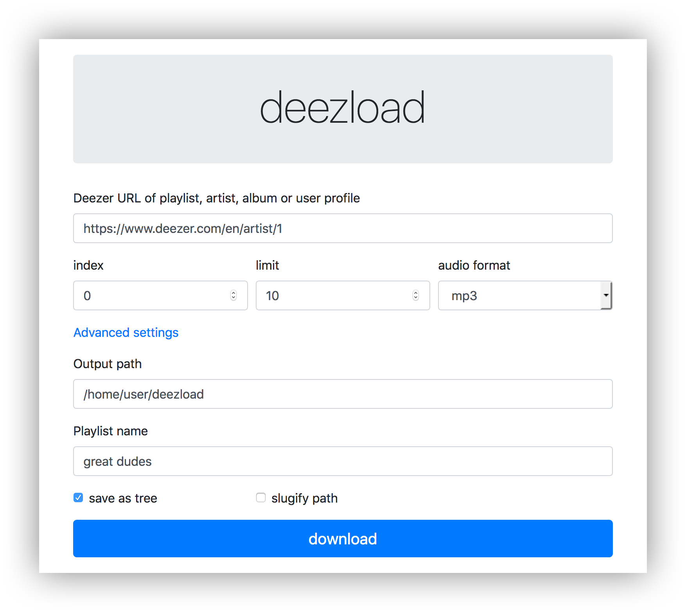
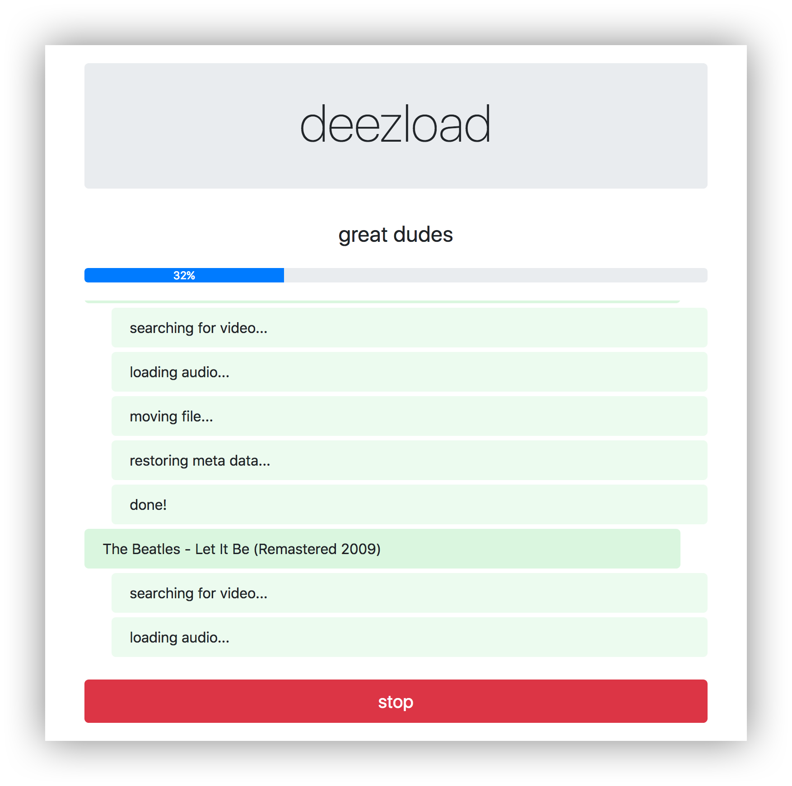
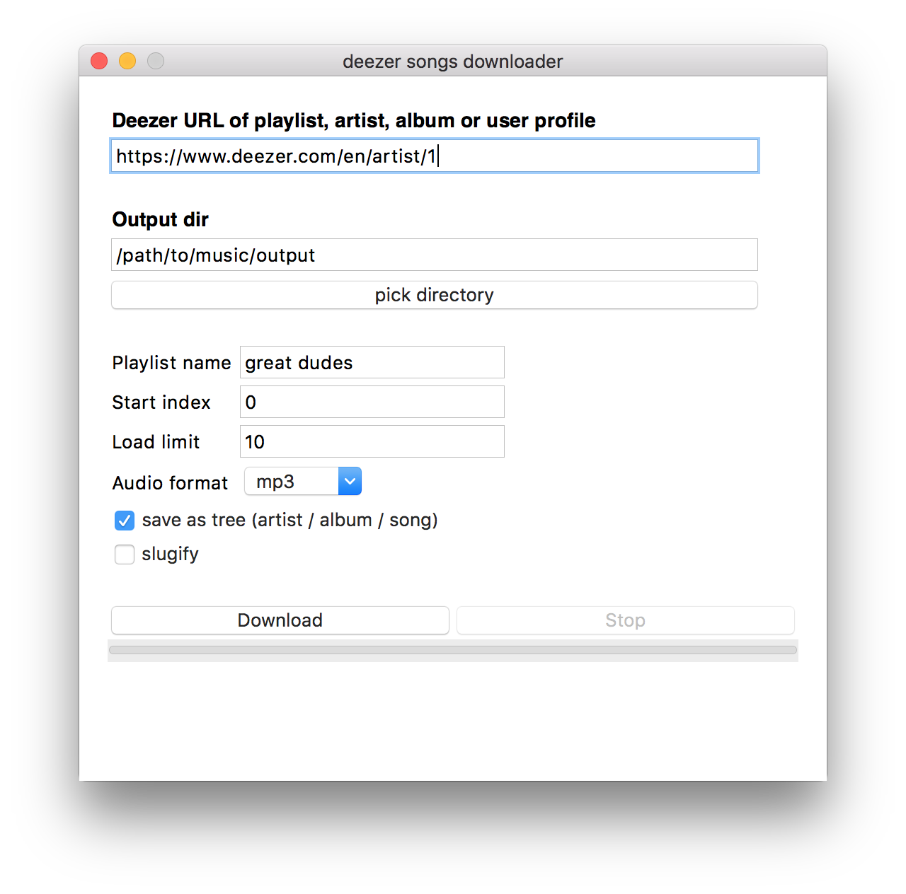

# deezload

Utility for downloading playlists, artist's top tracks, albums and favorite user's tracks from Deezer.

### pros

- structured music library
- easy sync with deezer
- multiple choices to use app

### cons

- hella slow - in average 12s per song for downloading/converting
- maybe illegal somewhere, but who knows? (probably lawyers, ask them)

## TOC

- [install](#install)
  - [local](#local)
  - [docker](#pull-from-docker-hub)
- [usage](#usage)
	- [command line](#command-line)
  - [web gui](web-gui)
  - [tk gui](#tk-gui)
  - [docker](#docker)
- [build standalone app](#build-standalone-app)
- [results](#results)
- [how it works](#how-it-works)
- [env vars](#env-vars)


## install

### local
```bash
pip install deezload
# or if you want to build standalone app
pip install deezload[pyinstaller]
# or if you love to play with fire
pip install git+https://github.com/vanyakosmos/deezload
```

install ffmpeg (or avconv) on os x:
```bash
brew search ffmpeg
```
for another systems [check out here](https://github.com/adaptlearning/adapt_authoring/wiki/Installing-FFmpeg) or [here](https://duckduckgo.com/?q=install+ffmpeg)

### pull from docker hub

```bash
docker pull aiven/deezload
```

## usage

### command line

```bash
# load album
deezload album/123
deezload https://www.deezer.com/en/album/123

# load playlist
deezload https://www.deezer.com/en/playlist/123

# load favorite tracks
deezload https://www.deezer.com/en/profile/123
deezload https://www.deezer.com/en/profile/123/loved

# load one track
deezload https://www.deezer.com/en/track/123

# load artist's top tracks
deezload https://www.deezer.com/en/artist/123
```

help:
```
usage: deezload [-h] [-i INDEX] [-l LIMIT] [-d] [-o OUTPUT_DIR] [-f FORMAT]
                [--flat] [--ui {tk,web}] [--build BUILD]
                [urls [urls ...]]

positional arguments:
  urls           list of URLs

optional arguments:
  -h, --help     show this help message and exit
  -i INDEX       start index
  -l LIMIT       load limit
  -d             debug mode
  -o OUTPUT_DIR  output directory (default HOME/deezload)
  -f FORMAT      output audio file format (default mp3)
  --flat         save files as simple list instead of as tree:
                 artist/album/song (default false)
  --ui {tk,web}  ui type (default tk)
  --build BUILD  build output path
```


### web gui

[Sanic](https://github.com/huge-success/sanic) websocket server + bootstrap.

```bash
deezload --ui web
```





### tk gui

Kinda crappy but works.

```bash
deezload  # start
deezload --ui tk  # just for sure
```




### docker

Launch web application from docker container.

```bash
# run:
docker run -v /host/abs/path/to/output:/output -p 8000:8000 aiven/deezload

# don't update youtube_dl on launch:
docker run -v /foo:/output -p 8000:8000 -e "UPYT=0" aiven/deezload
```


## build standalone app

Run this
```bash
deezload --build .
deezload --build path/to/build/output
```
and check out `output/dist` for executables.


## results

As the result of processing in output directory you should find m3u playlist and downloaded songs structured as artist/album/song.


## how it works

- parse deezer url and find appropriate api url
- fetch tracks from deezer
- search for each song on youtube
- download audio steam and convert into needed format
- restore songs metadata
- save files


## env vars

- `DEEZLOAD_DEBUG` - `0` or `1`, activates debug logging
- `DEEZLOAD_UI` - `tk` or `web`
- `DEEZLOAD_HOME` - output directory
- `UPYT` - `1` (default) or `0`. Update `youtube_dl` when running `run.sh` or docker image.
